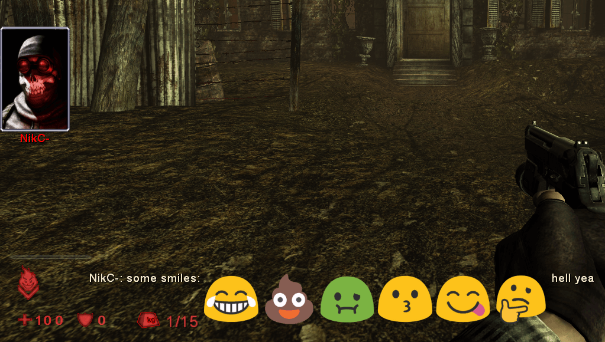

[KF Compile Tool]: https://github.com/InsultingPros/KFCompileTool
[DXT compression]: https://beyondunrealwiki.github.io/pages/dxt.html
[dkanus]: https://github.com/dkanus
[Marco]: https://steamcommunity.com/profiles/76561197975509070
[Server Perks]: https://forums.tripwireinteractive.com/index.php?threads/mut-per-server-stats.36898/
[Python >3.10.x]: https://www.python.org/downloads/
[Pillow]: https://pillow.readthedocs.io/en/stable/
[android 7 emojis]: https://emojipedia.org/google/android-7.0/

# KF Emoji Pack

[](https://github.com/InsultingPros/KFEmojiPack/releases)

This project aims to make [Server Perks] emoji pack creation much easier. There are several community made packs, but they are well hidden and there is almost no up-to-date documentation on how to make them. So I'm filling that gap.

With **KFEmojiPack** you can simply drag-n-drop images, click on a script and get a ready to use file. No SDK or long googling required.

This mod provides a compiled example with [android 7 emojis] and a handy script which allows to create your custom pack in few clicks.



```text
say some smiles: face-with-tears-of-joy pile-of-poo nauseated-face kissing-face face-savouring-delicious-food thinking-face hell yea
```

## Usage

> **Note** If you want to resize emojis tweak `RESIZE_DIMENSIONS` inside `Converter.py`. 128x128 are shown in example screenshot, 32x32 will be same size as the other text. And if you want to make emoji pack a bit smaller, change the [DXT compression] as well.

0. Install [Python >3.10.x] and [Pillow] (`requirements.txt` is also provided).
1. Download the release / clone the repository.
2. Rename the folder name by your taste.
3. Put your images into `Input` folder.
4. Click on `Converter.py`. That will:
    - Convert all images to required format.
    - Resize them in the most efficent way and move to `Output` folder.
    - Auto-generate exec directives in `GenerateTexture.uc`.
    - Create a template for `ServerPerks.ini` with all required smile lines.

All you left to do:

- Compile your mod (you can use [KF Compile Tool] for easy compilation) and manually change compiled file extension from `.u` to `.utx`. Don't forget to do the same for redirect file!
- Copy-paste `SmileyTags` lines from generated [template](Configs/ServerPerks_Template.ini) to your server's `ServerPerks.ini`.

Done! Start your server and enjoy.

## Supported input file formats

```text
BMP, DIB, EPS, GIF, ICNS, ICO, IM, JPG, JPEG, J2K, J2P, JPX, MSP, PCX, PNG, PPM, SGI, SPIDER, TGA, TIFF, WebP, XBM.
```

## Credits

- [Marco] - I took the idea from his [Server Perks].
- [dkanus]- he hinted me that I can simply rename `u` package to `utx`.
- Google - your [android 7 emojis] were the best.
